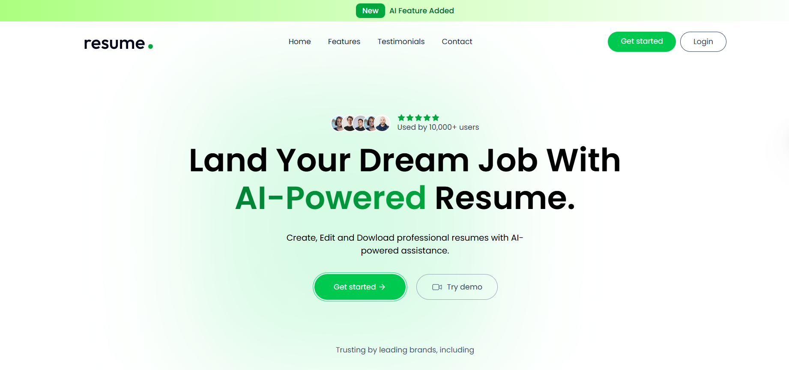
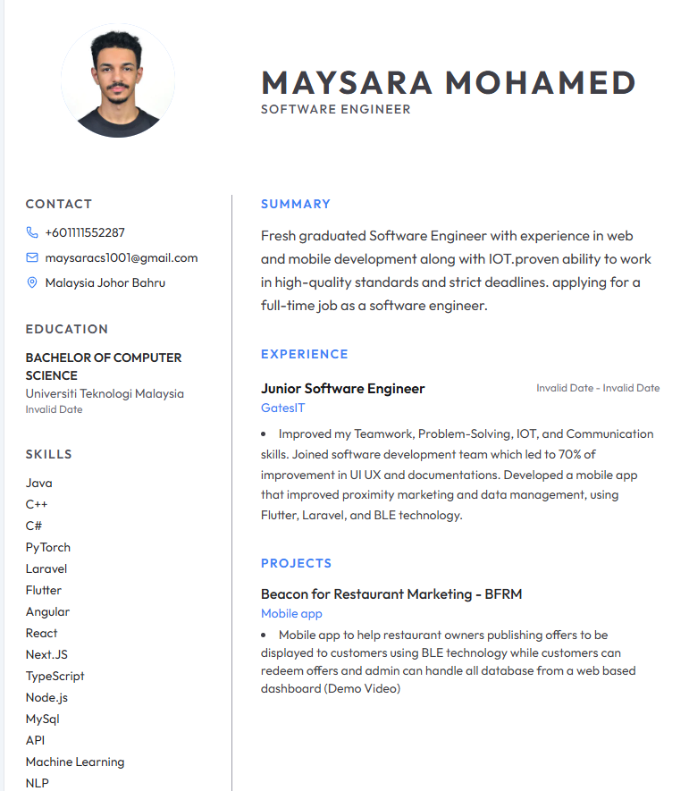
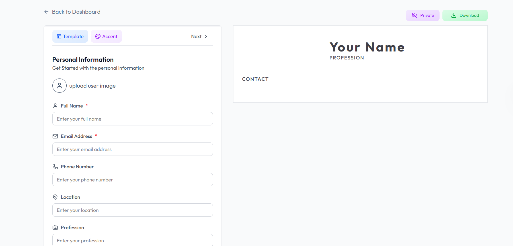
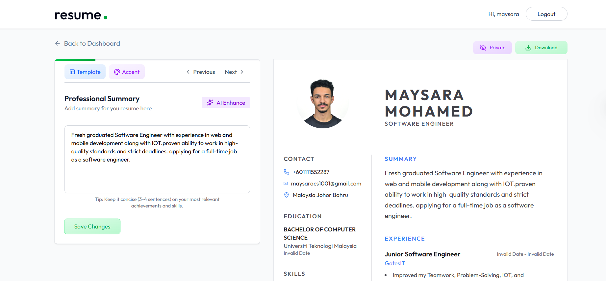

# Resume Builder

A full-stack web application that helps users create professional resumes with AI-powered assistance.

## What This Project Does

This application allows users to:

- Create and manage multiple resumes
- Build resumes using different professional templates
- Get AI suggestions for professional summaries and job descriptions
- Upload existing resumes and extract information automatically
- Download completed resumes as PDFs
- Share resumes publicly via unique links

## Features

- **User Authentication** - Sign up and log in to manage your resumes
- **Multiple Templates** - Choose from Classic, Modern, Minimal, and Minimal Image layouts
- **AI Enhancement** - Improve your professional summary and job descriptions with AI
- **Resume Upload** - Upload PDF resumes and automatically extract information
- **Customization** - Change accent colors and customize content
- **Public Sharing** - Make resumes public and share them with others
- **PDF Download** - Download your resume as a PDF file

## Screenshots

### Landing Page



### Dashboard



### Resume Builder



### Resume Preview



## Technologies Used

### Frontend

- React
- Redux Toolkit
- Tailwind CSS
- React Router
- Axios

### Backend

- Node.js
- Express
- MongoDB
- OpenAI API
- ImageKit (for image processing)
- JWT Authentication

## Getting Started

### Prerequisites

- Node.js installed
- MongoDB database
- OpenAI API key
- ImageKit account

### Installation

1. Clone the repository

```bash
git clone <repository-url>
```

2. Install dependencies for both client and server

```bash
cd client
npm install

cd ../server
npm install
```

3. Set up environment variables

Create a `.env` file in the server directory:

```
MONGODB_URI=your_mongodb_uri
JWT_SECRET=your_jwt_secret
OPENAI_API_KEY=your_openai_key
OPENAI_BASE_URL=your_openai_base_url
OPENAI_MODEL=your_model_name
IMAGEKIT_PRIVATE_KEY=your_imagekit_key
PORT=3000
```

Create a `.env` file in the client directory:

```
VITE_BASE_URL=http://localhost:3000
```

4. Run the application

Start the server:

```bash
cd server
npm start
```

Start the client:

```bash
cd client
npm run dev
```

## Usage

1. Register for an account or log in
2. Create a new resume or upload an existing one
3. Fill in your personal information, experience, education, and skills
4. Use AI enhancement to improve your content
5. Choose a template and customize the accent color
6. Download your resume or share it publicly

## License

This project is open source and available for personal and educational use.
